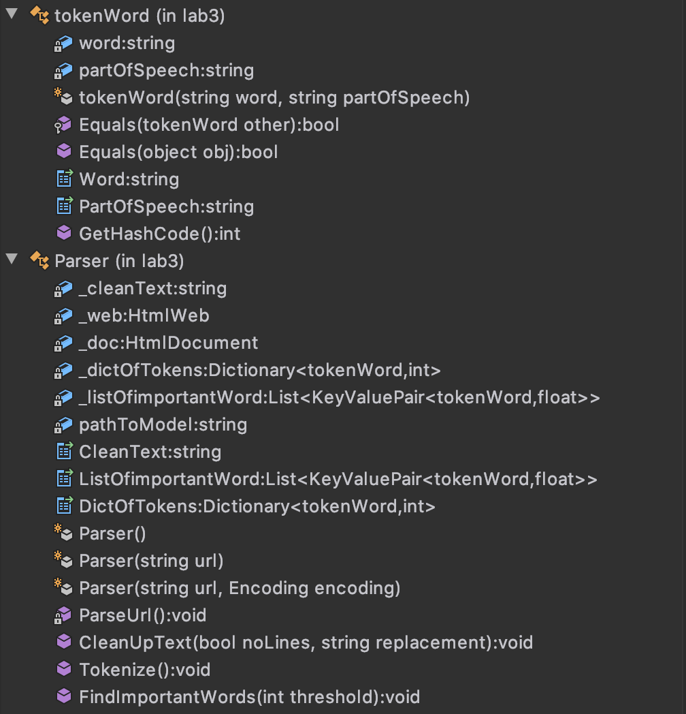
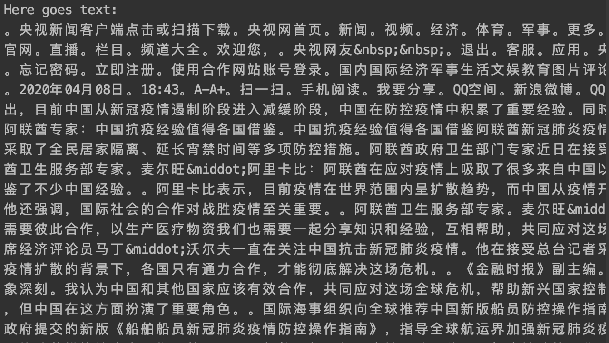
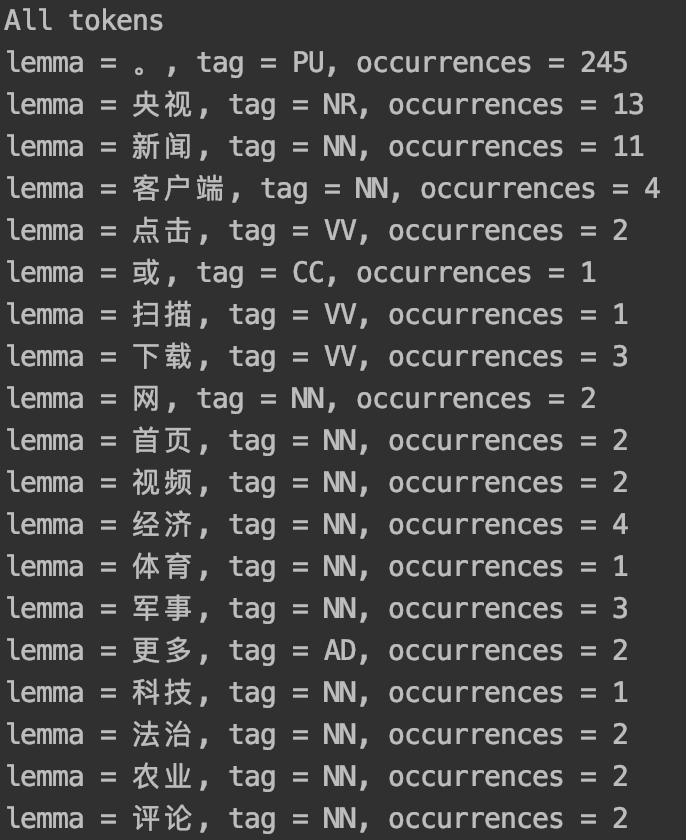
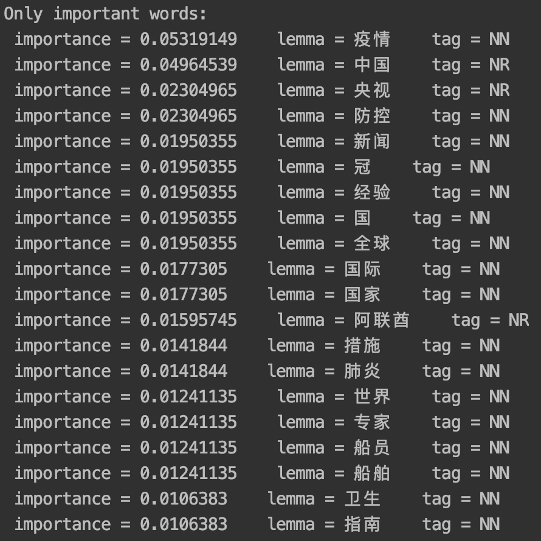

# 实验3

## 引言
#### 内容：
2.1 构建一个基于C#的组件，该组件具有以下功能:

1. 给一个链接地址，下载这个地址所指向的网页；
2. 对下载的网页进行去重、中文分词等，并给出这个文档的“主题词”和各词的重要性评价。

#### 环境
 - 操作系统：MacOS
 - 语言：C#, .Net Framework 4.0+
 - IDE: Jetbrains的 Rider
 - 编译器：Mono
 - 库：Stanford.NLP, IKVM, HtmlAgilityPack


## 具体过程
该项目的难点是将中文文本标记化。 我们不能只使用C＃中的split() 函数来拆分单词（不如英文那么方便），而是应该使用一些NLP模型从文本中获取不同的单词。 我决定将StanfordNLP模型用于中文，因为它在NuGet中有一个包，并且非常受欢迎。

#### 1. 安装库（NLP模型）
首先，从NuGet中，我们应该安装Stanford.NLP.CoreNLP（实际上您不需要使用CoreNLP，但是它具有更多功能），IKVMm，HtmlAgilityPack。 我们只需要将它们安装到 _parserClass_ 项目即可。

之后，我们应该从[这里](https://github.com/stanfordnlp/CoreNLP#latest-models)下载模型（与Stanford.NLP.CoreNLP软件包相同的版本）。就我而言，我已经下载了English(Full)和Chinese。（实际上，对于该项目，我使用了带有v.3.9.2软件包的较旧模型，并且仍然可以使用）

模型存储在.jar文件中（对于英语模型，则为`stanford-corenlp-3.9.2.jar`），因此您需要取消存档文件并合并英语和中文模型的文件夹。 确保文件夹结构如下所示：

```
|____stanford-corenlp-3.9.2-models
| |____edu
| | |____stanford
| | | |____nlp
| | | | |____coref
| | | | | |____...
| | | | |____dcoref
| | | | | |____...
| | | | |____models
| | | | | |____...
| | | | |____pipeline
| | | | | |____...
| |____StanfordCoreNLP-chinese.properties
| |____StanfordCoreNLP.properties

```

为了使该项目正常工作，您需要将合并的模型文件夹放在parserClient可执行文件（.exe文件）旁边。 在这个项目中，它位于：`lab3 / parserClient / bin / Release / stanford-corenlp-3.9.2-models`

为了使该项目运行，最少的注释器为：

`annotators = tokenize, ssplit, pos, lemma, ner, parse`

可以在.properties文件中进行编辑（在本例中为`StanfordCoreNLP-chinese.properties`）

#### 2. 代码
##### parserClass结构:



##### info:
- _tokenWord_ 类仅用于更好地表示找到的令牌
- _Parser_ 类的对象应使用url（字符串）初始化
- _ParseUrl_ 方法从提供的网址中提取纯文本，并将其保存到_Parser_实例的`_cleanText`中
- _CleanUpText_ 方法最初旨在删除空白行，并用替换字符/字符串替换它们
- _Tokenize_ 方法在`_cleanText`中查找令牌并将其保存到`_dictOfTokens`中，其中Key表示令牌，Value表示其出现次数
- _FindImportantWords_ 方法仅对重要单词（名词）进行分类，并将其保存到_listOfimportantWord中，在KeyValuePair中，Key表示令牌，Value表示其 _importance_。 您可以编辑最小出现次数的阈值。
- 所谓的单词（名词）的 _importance_ 的计算方法如下：word_occurrences / number_of_all_words

##### 样例程序：
```csharp
Parser test = new Parser("http://m.news.cctv.com/2020/04/08/ARTIbjzDJnaeM8IuoYU5QRWH200408.shtml");
test.CleanUpText();
Console.WriteLine("Here goes text:");
Console.Write(test.CleanText);


test.Tokenize();
Console.WriteLine("All tokens");
foreach (KeyValuePair<tokenWord, int> kvp in test.DictOfTokens)
{
	Console.WriteLine("lemma = {0,8}" + "\t" + "tag = {1}" + "\t" + "occurrences = {2}",
		kvp.Key.Word, kvp.Key.PartOfSpeech, kvp.Value);
}


test.FindImportantWords(5);
Console.WriteLine("Only important words:");
foreach (KeyValuePair<tokenWord, float> kvp in test.ListOfimportantWord)
{
	Console.WriteLine(" importance = {0:0.0000}" + "\t" + "lemma = {1}" + "\t" + "tag = {2}",
		kvp.Value, kvp.Key.Word, kvp.Key.PartOfSpeech);
}
```

##### 程序的结果（部分）：






## 总结
可以以更有效的方式编写该程序。 使用Stanford CoreNLP工具仅对中文文本进行标记化实际上这种做法太过分了。 由于在C＃中（与IKVM一起）运行JVM并没有在Java中直接使用JVM，因此失去了一些处理能力。 为了运行该模型，需要2-3 GB的RAM，而模型则需要使用1.5GB以上的存储空间。 但是总体而言，此框架在自然语言处理中提供了很大的灵活性，必须在更高级的应用程序中使用。
