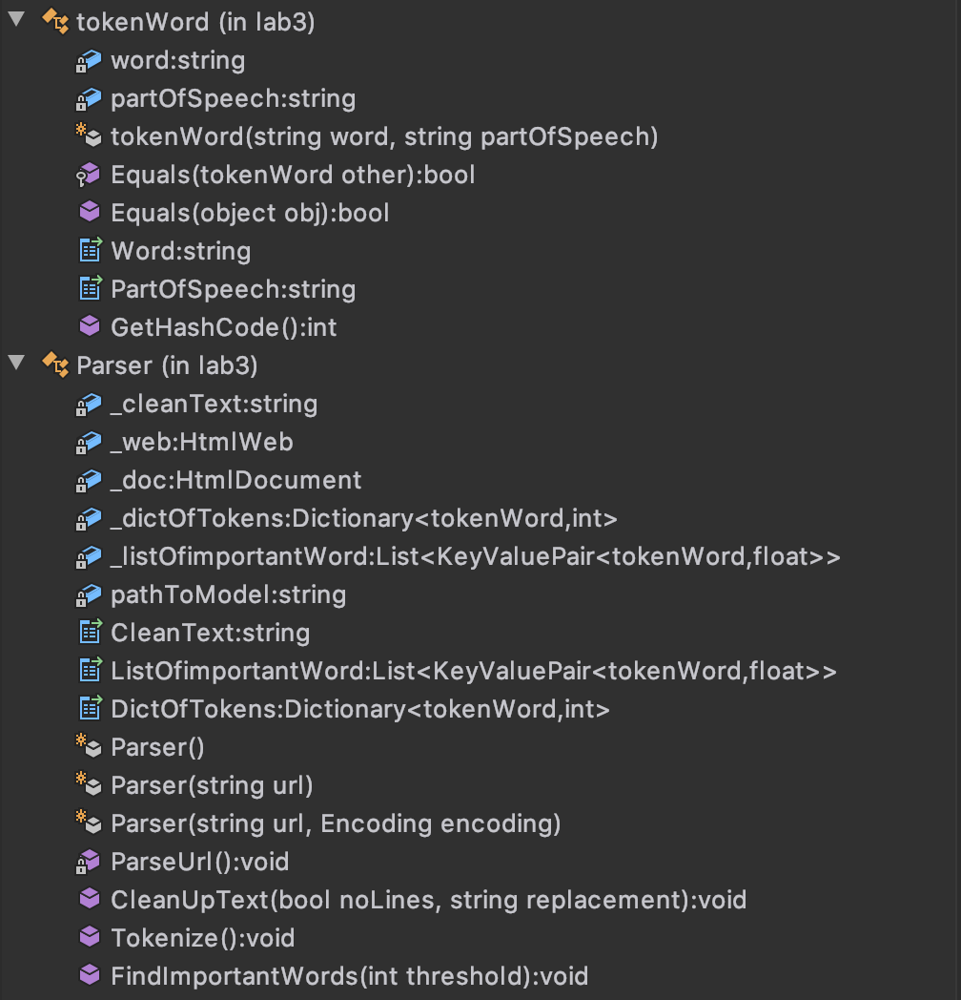
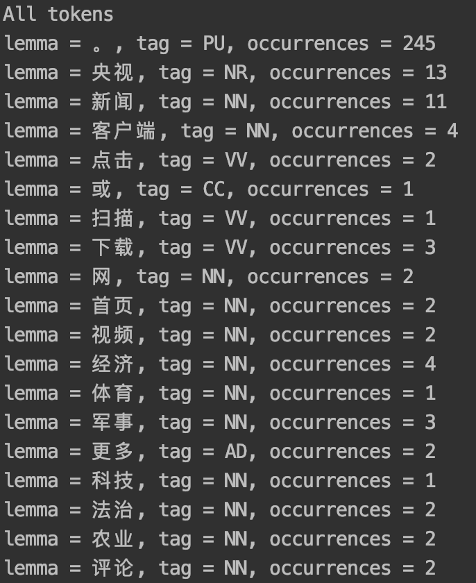
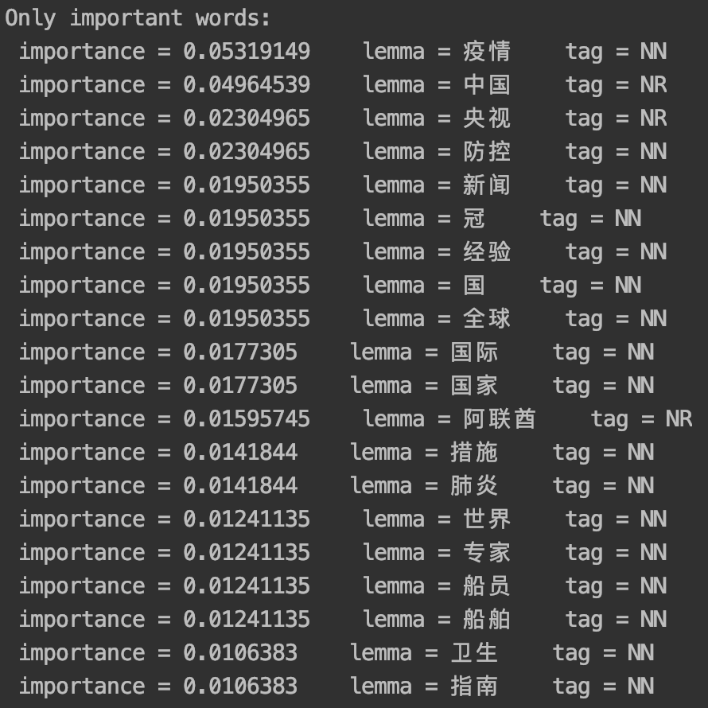

# 实验3

## Introduction
#### Objective
2.1 Build a C # -based component, which has the following functions:

1. Give a link address and download the webpage pointed to by this address;
2. Perform deduplication, Chinese word tokenization, etc. on the downloaded web page, and give the "subject/main words" of this document and the importance evaluation of each word.

#### Environment
 - OS: MacOS
 - Language: C#, .Net Framework 4.0+
 - IDE: Jetbrains的 Rider
 - Compiler: Mono
 - Packages/Libraries：Stanford.NLP, IKVM, HtmlAgilityPack


## Process
The main difficulty in this project is to tokenize chinese text. We cannot just use split() function in C# to split word (like we would do for english), instead we should use some NLP model to get distinct words from a text. I've decided to use StanfordNLP model for chinese language, because it has a package in NuGet and is quite popular. 

#### 1. Packages Installation (NLP models)
First of all, from NuGet we should install Stanford.NLP.CoreNLP (actually you don't need to use CoreNLP, but it has more functions), IKVMm, HtmlAgilityPack. We only need to install it them to _parserClass_ project. 

After that we should download models (the same version as Stanford.NLP.CoreNLP package) from [here](https://github.com/stanfordnlp/CoreNLP#latest-models). In my case I've downloaded English(full) and Chinese. (Actually, for this project I've used older models with package v.3.9.2 and still works)

Models are stored in .jar files(for english models it's `stanford-corenlp-3.9.2.jar`), so you need to unarchive the files and merge english and chinese models' folders. Make sure folder structure looks like this:

```
|____stanford-corenlp-3.9.2-models
| |____edu
| | |____stanford
| | | |____nlp
| | | | |____coref
| | | | | |____...
| | | | |____dcoref
| | | | | |____...
| | | | |____models
| | | | | |____...
| | | | |____pipeline
| | | | | |____...
| |____StanfordCoreNLP-chinese.properties
| |____StanfordCoreNLP.properties

```

For this project to work you need to put merged models folder next to the parserClient executable(.exe file). In this project it's located in: `lab3/parserClient/bin/Release/stanford-corenlp-3.9.2-models`

For this project to run the minimum amount of annotators is: 

`annotators = tokenize, ssplit, pos, lemma, ner, parse`

It can be edited in .properties file (in this case `StanfordCoreNLP-chinese.properties`)

#### 2. Code
##### parserClass structure:



##### info:
- _tokenWord_ class was created only for a better representation of found tokens
- object of a class _Parser_ should be initialized with url (string)
- _ParseUrl_ method extracts clean text from provided url and saves it to `_cleanText` of a _Parser_ instance(实例) 
- _CleanUpText_ method was initially designed to delete blank lines and replace them with replacement character/string
- _Tokenize_ method finds tokens in `_cleanText` and saves them to `_dictOfTokens`, where Key represents a token and Value represents number of its occurrences
- _FindImportantWords_ method sorts out only important words(nouns) and saves them to `_listOfimportantWord`, in KeyValuePair Key represents a token and Value represents  its _importance_. You can edit threshold for the minimum number of occurrences.
- so called _importance_ of a word(noun) is calculated in the following way: word_occurrences / number_of_all_words

##### sample program:
```csharp
Parser test = new Parser("http://m.news.cctv.com/2020/04/08/ARTIbjzDJnaeM8IuoYU5QRWH200408.shtml");
test.CleanUpText();
Console.WriteLine("Here goes text:");
Console.Write(test.CleanText);


test.Tokenize();
Console.WriteLine("All tokens");
foreach (KeyValuePair<tokenWord, int> kvp in test.DictOfTokens)
{
	Console.WriteLine("lemma = {0,8}" + "\t" + "tag = {1}" + "\t" + "occurrences = {2}",
		kvp.Key.Word, kvp.Key.PartOfSpeech, kvp.Value);
}


test.FindImportantWords(5);
Console.WriteLine("Only important words:");
foreach (KeyValuePair<tokenWord, float> kvp in test.ListOfimportantWord)
{
	Console.WriteLine(" importance = {0:0.0000}" + "\t" + "lemma = {1}" + "\t" + "tag = {2}",
		kvp.Value, kvp.Key.Word, kvp.Key.PartOfSpeech);
}
```

##### outcome (partly):






## Summary
This program can be written in a much more efficient way. It is actually an overkill to use Stanford CoreNLP tool for just tokenization of a chinese text. Some processing power is lost due to running JVM in C# (with IKVM) and not using it straightaway in Java. Just to run this model 2-3 GB of RAM is required and more then 1.5GB of storage is used by models. But overall this framework provides a lot of flexibility in Natural Language Processing and must be used in a more advances applications.
